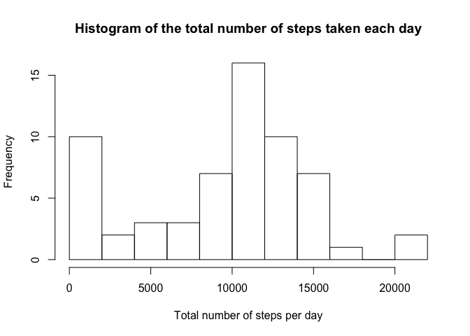
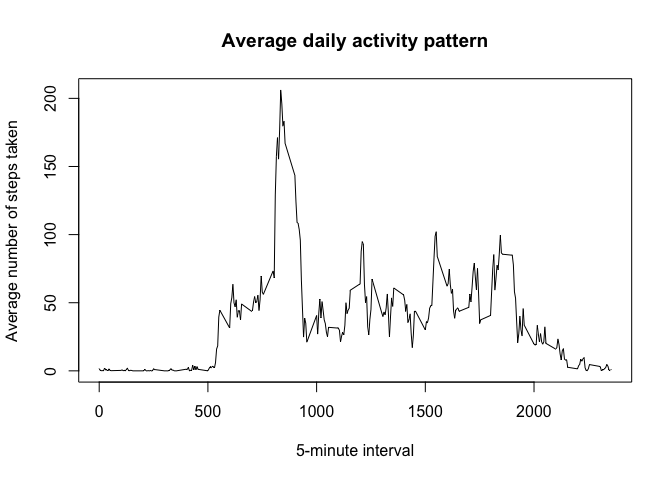
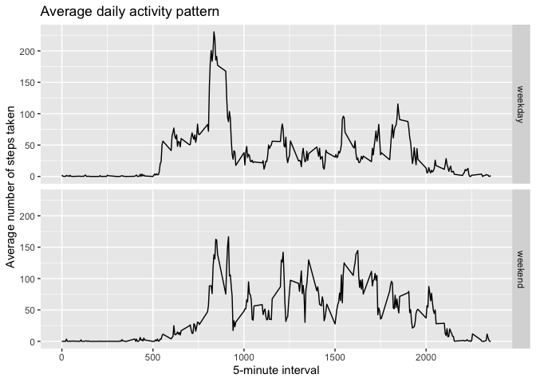

Load activity monitoring dataset and librarys necessary 

```r
activity = read.csv("activity.csv")

library(ggplot2)
```

## What is mean total number of steps taken per day?
Calculate the total number of steps taken per day and make a histogram of the total number of steps taken each day

```r
stepsPerDay <- tapply(activity$steps, activity$date, sum, na.rm = TRUE)
hist(stepsPerDay, breaks = 10,
                  main = "Histogram of the total number of steps taken each day", 
                  xlab = "Total number of steps per day")
```

<!-- -->

Calculate and report the mean and median of the total number of steps taken per day

```r
meanSteps<- mean(stepsPerDay)
medianSteps<- median(stepsPerDay)
```
Mean of the total number of steps taken per day is: " 9354.2295082
Median of the total number of steps taken per day is: 10395


## What is the average daily activity pattern?

Make a time series plot of the 5-minute interval (x-axis) and the average number of steps taken, averaged across all days (y-axis)

```r
stepsPerInterval<-aggregate(steps ~ interval, data = activity, mean, na.rm = TRUE)

plot(stepsPerInterval$interval, stepsPerInterval$steps, type = "l",
     main = "Average daily activity pattern", xlab = "5-minute interval", 
                                              ylab = "Average number of steps taken")
```

<!-- -->

Which 5-minute interval, on average across all the days in the dataset, contains the maximum number of steps?

```r
maxSteps <- which.max(stepsPerInterval$steps)

stepsPerInterval[maxSteps, ]
```

```
##     interval    steps
## 104      835 206.1698
```

## Imputing missing values

Calculate and report the total number of missing values in the dataset

```r
missingValues <- sum(is.na(activity))
```
Total number of missing values in activity monitoring data set is:  2304


Devise a strategy for filling in all of the missing values in the dataset. Create a new dataset that is equal to the original dataset but with the missing data filled in.

```r
activityImputed <- activity
for (i in 1:nrow(activityImputed)) {
  if(is.na(activityImputed$steps[i])){
    interval <- activityImputed$interval[i]
    activityImputed$steps[i] <- stepsPerInterval[stepsPerInterval$interval == interval,]$steps
  }
}
head(activityImputed)
```

```
##       steps       date interval
## 1 1.7169811 2012-10-01        0
## 2 0.3396226 2012-10-01        5
## 3 0.1320755 2012-10-01       10
## 4 0.1509434 2012-10-01       15
## 5 0.0754717 2012-10-01       20
## 6 2.0943396 2012-10-01       25
```

Make a histogram of the total number of steps taken each day

```r
stepsPerDayImputed <- tapply(activityImputed$steps, activityImputed$date, sum)
hist(stepsPerDay, breaks = 10,
                  main = "Histogram of the total number of steps taken each day", 
                  xlab = "Total number of steps per day")
```

<!-- -->
Calculate and report the mean and median total number of steps taken per day. 

```r
meanStepsImputed<- mean(stepsPerDayImputed)
medianStepsImputed<- median(stepsPerDayImputed)
```
Mean of the total number of steps taken per day (with NAs substituted) is: ", 9354.2295082
"Median of the total number of steps taken per day (with NAs substituted) is: 10395


## Are there differences in activity patterns between weekdays and weekends?

Create a new factor variable in the dataset with two levels – “weekday” and “weekend” indicating whether a given date is a weekday or weekend day.

```r
activityImputed$dayType <-weekdays(as.Date(activityImputed$date))
activityImputed$dayType[activityImputed$dayType 
                        %in% c('Monday','Tuesday', 'Wednesday', 'Thursday', 'Friday')] <- "weekday"
activityImputed$dayType[activityImputed$dayType 
                        %in% c('Saturday', 'Sunday')] <- "weekend"
activityImputed$dayType <- as.factor(activityImputed$dayType)
```

Make a panel plot containing a time series plot of the 5-minute interval (x-axis) and the average number of steps taken, averaged across all weekday days or weekend days (y-axis).

```r
stepsPerIntervalImputed<-aggregate(steps ~ interval + dayType, data = activityImputed, mean)

ggplot(data = stepsPerIntervalImputed,aes(interval, steps)) +
  geom_line() +
  facet_grid(dayType ~ .) +
  ggtitle("Average daily activity pattern") +
  xlab("5-minute interval") + 
  ylab("Average number of steps taken")
```

<!-- -->
